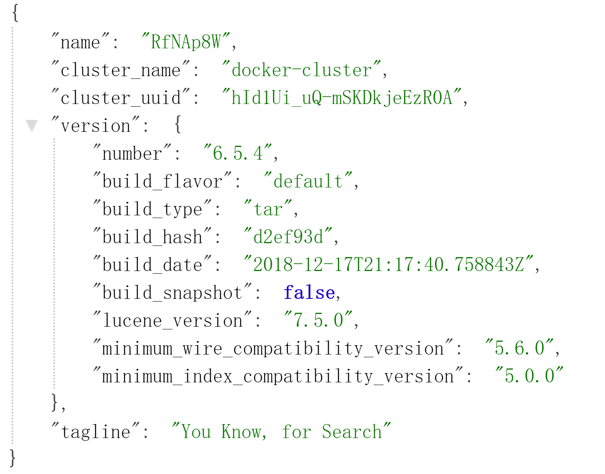
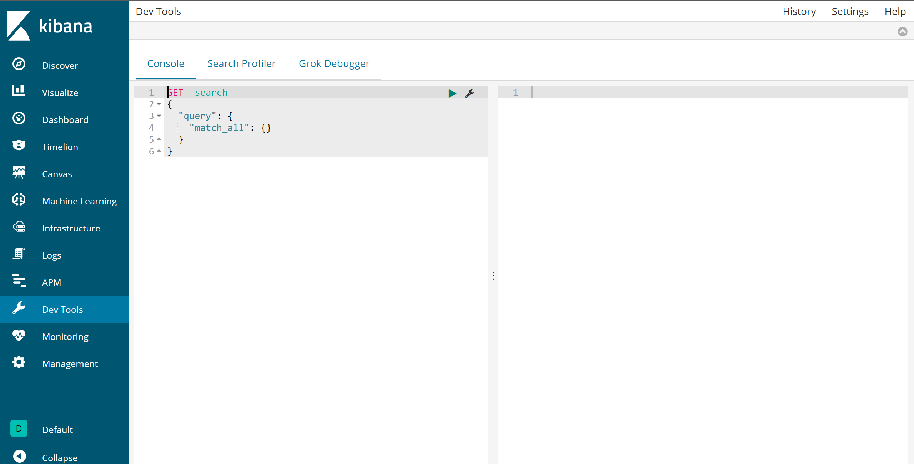
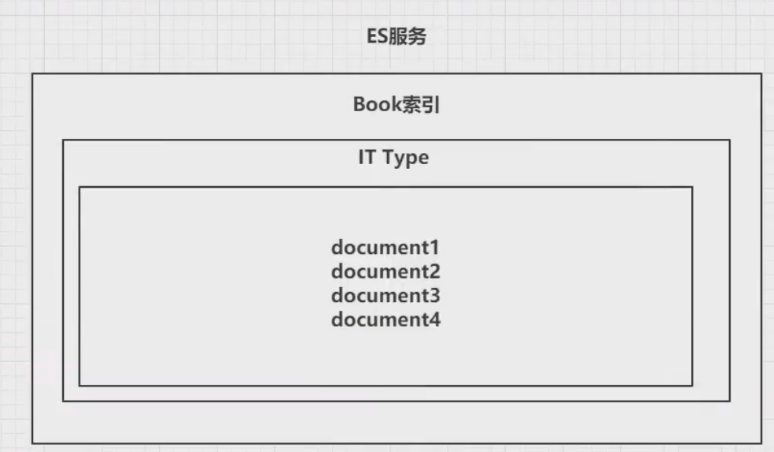
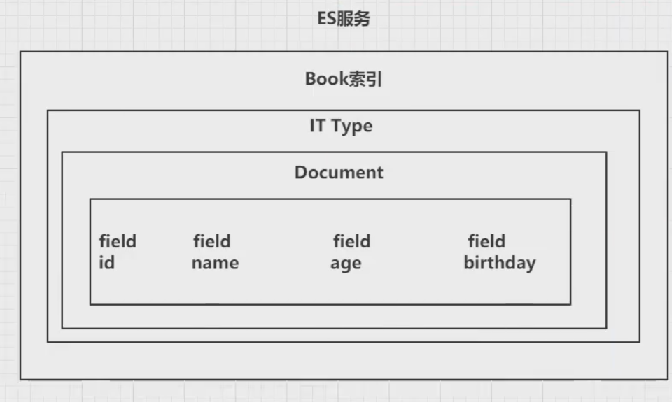
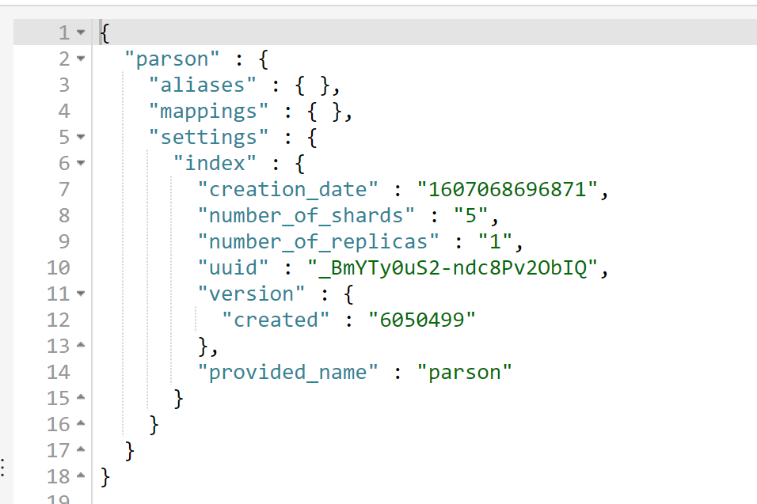
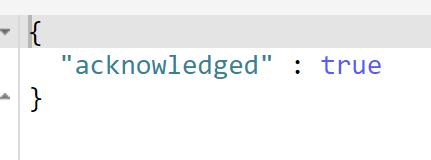
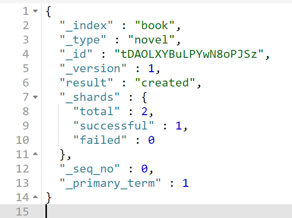
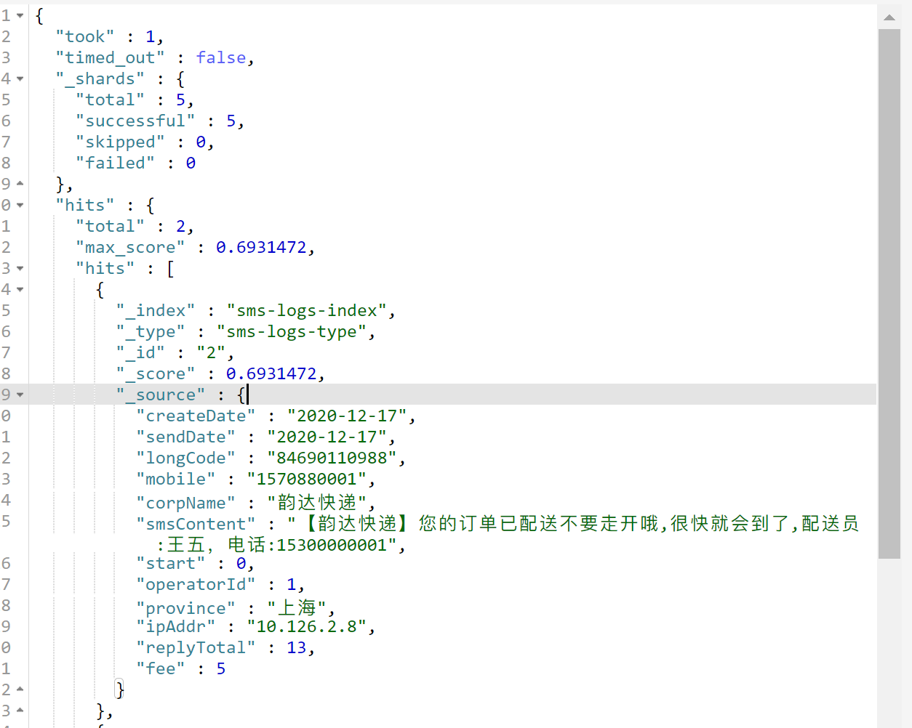
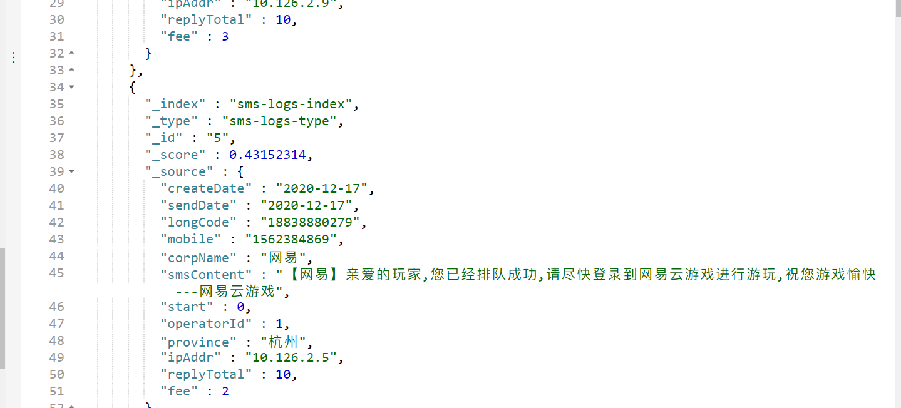
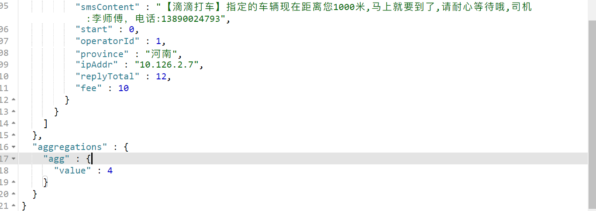

## 一 ElasticSearch

==Elaticsearch==，简称为es， es是一个开源的高扩展的分布式全文检索引擎，它可以近乎实时的存储、检索数据；本身扩展性很好，可以扩展到上百台服务器，处理==PB级别(1PB=1024TB)==的数据。es也使用Java开发并==使用Lucene作为其核心==来实现所有索引和搜索的功能，但是它的目的是通过简单的==RESTful API来隐藏Lucene的复杂性==，从而让全文搜索变得简单。

Elaticsearch，有全文检索的功能（倒排索引）：把一句话分成各个词，查询的时候根据关键字找到相应的数据：


### 1 ElasticSearch对比Solr

|          | Solr                           | Elasticsearch                                |
| -------- | ------------------------------ | -------------------------------------------- |
| 管理方式 | 分布式管理,需要zookeeper的协助 | 自身带有分布式协调管理功能                   |
| 数据格式 | 支持更多格式的数据             | 仅支持json文件格式                           |
| 功能     | 功能更多                       | 更注重于核心功能，高级功能多有第三方插件提供 |
| 效果     | 不变数据效果好                 | 实时搜索更强                                 |

### 2 安装

#### 2.1 ES安装/Kibana

在centOs中采用Docker安装

```yml
version: '2'
services:
  elasticsearch:
    container_name: elasticsearch
    image: daocloud.io/library/elasticsearch:6.5.4
    ports:
      - "9200:9200"
    environment:  # 分配的内存，必须指定，因为es默认指定2g，直接内存溢出了，必须改
      - "ES_JAVA_OPTS=-Xms128m -Xmx256m"
      - "discovery.type=single-node"
      - "COMPOSE_PROJECT_NAME=elasticsearch-server"
    restart: always

  kibana:
    container_name: kibana
    image: daocloud.io/library/kibana:6.5.4
    ports:
      - "5601:5601"
    restart: always
    environment:
      - ELASTICSEARCH_HOSTS=http://192.168.10.106:9200
```

然后在CentOs中：

```sh
# 进入opt
cd /opt/
# 创建文件夹
mkdir docker_es
# 创建并编辑配置文件
vi docker-compose.yml
# 运行
docker-compose up  -d
# 查看日志，观察是否成功启动
docker-compose logs -f
```

看到显示时间日期等信息就是启动成功了，这时候访问192.168.10.106：9200就能见到json的字符串，代表es启动成功



进入192.168.10.106：5601就能看到kibana的图形界面了：

* 在这里写基于Restful风格的接口来访问es



* 在这里查看es的一些信息


#### 2.2 安装IK分词器

es的检索对中文的支持不好，使用国内的IK分词器

```sh
#查看es的名称，可以看到是45开头的
docker ps
```


```sh
# 进入es，可以看到已经进入es目录中了
docker exec -it  名称的简写 bash
```


```sh
# 查看安装插件的命令是es-pigin
cd bin/
```


```sh
# 安装我们的KI分词器
# 下载路径为https://github.com/medcl/elasticsearch-analysis-ik/releases/download/v6.5.4/elasticsearch-analysis-ik-6.5.4.zip
./elasticsearch-plugin install github的下载路径
```

==注意==：必须重启es这个KI分词器才会生效:

```sh
# 退出容器
exit
# 重启es
docker restact es的名称简写这里是45
# 访问192.168.10.106:9200查看是否重启成功
```

在Kibana中测试，可以看到成功的将词语分为几个


## 二 ES结构

es的存储结构与我们传统的数据库相差还是很大的：

### 1 索引index

```markdown
# 1 ES的服务中可以创建多个索引，
# 2 每个索引默认分成5片存储，
# 3 每一个至少有一个备份分片
# 4 备份分片正常不会帮助检索数据，除非ES的检索压力很大的情况发送
# 5 如果只有一台ES，是不会有备份分片的，只有搭建集群才会产生
```


### 2 类型type

```markdown
# 1 ES5.x下，一个index可以创建多个type
# 2 ES6.x下，一个index只能创建一个type
# 3 ES7.x下，直接舍弃了type，没有这玩意了
```


### 3 文档doc

```markdown
# 一个type下可以有多个文档doc，这个doc就类似mysql表中的行
```


### 4 属性field

```markdown
# 一个doc下可以有多个属性field，就类似于mysql的一列有多行数据
```



## 三 Restful语法

```markdown
es几种常见的请求方式，与我们的传统的Restful有区别
# get请求（获取数据）
    http://ip:port/index    # 查询es的index
    http://ip:port/index/type/doc_id   # 根据文档id查询指定文档的信息
# post请求
    http://ip:port/index/type/_search  # 查询文档，可以在请求体中添加json字符串的内容，代表查询条件
    http://ip:port/index/type/doc_id/_update # 修改文档 ，在请求体中指定json字符串，代表修改条件
# put请求
    http://ip:port/index  # 创建索引,请求体中指定索引的信息
    http://ip:port/index/type_mappings # 创建索引，然后指定索引存储文档的属性
# delete请求
    http://ip:port/index  # 删除索引 
    http://ip:port/index/type/doc_id # 删除指定的文档
```

## 四 操作

### 1 索引的操作

```json
// 1 创建名为parson的索引
PUT /parson
{
  "settings": {
    "number_of_shards": 5,      // 默认分片为5
    "number_of_replicas": 1    // 默认备份为1
  }
}
```

```json
// 2 查看索引，可以通过图形界面，也可以通过发请求来查看，信息如下：
GET /parson
```



```json
// 3 删除索引,依然可以通过图形界面操作，然后这里请求删除会有这样的json返回，代表删除成功
DELETE /parson
```



### 2 field的类型

就像是mysql的每列一样，int,string,data......，field也需要指定相应的类型

```markdown
# 1 字符串类型
    text           # 最常用，一般用于全文检索，会给fleld分词
    keyword        # 不会给fleld进行分词
# 2 数值类型
    long
    integer
    short
    byte
    double
    float
    half_float      # 精度比float小一半，float是32位，这个是16位
    scaled_float    # 根据long类型的结果和你指定的secled来表达浮点类型：long:123 ,secled:100，结果：1.23
# 3 时间类型
    date         # 可以指定具体的格式  "format": "yyyy-MM-dd HH:mm:ss||yyyy-MM-dd||epoch_millis"
# 4 布尔类型
    boolean   
# 5 二进制类型
    binary       # 基于base64的二进制
# 6 范围类型
    integer_range
    double_range
    long_range
    float_range
    data_range
    ip_range
# 7 经纬度类型
    geo_point   # 存储经纬度
# 8 ip类型
    ip    # v4 v6都可以
# 9 ....
```

###  3 创建索引并指定结构

```json
PUT /boot
{
  "settings": {
    "number_of_shards": 5,      // 分片数
    "number_of_replicas": 1     // 分页数
  },
  "mappings": { // 指定数据结构
    "novel":{    // 指定索引类型为novel              
      "properties":{  //文档存储的field
        "name":{          // 属性名
          "type": "text",   // 属性的类型
          "analyzer": "ik_max_word",  // 使用ik分词器
          "index": true,   // 当前field可以作为查询条件
          "store": false   // 是否需要额外的存储
        },
        "author":{
          "type": "keyword"
        },
        "count":{
          "type": "long"
        },
        "onSale":{
          "type": "date",
          "format": "yyyy-MM-dd HH:mm:ss||yyyy-MM-dd||epoch_millis"  // 三种格式都可以
        },
        "descr": {
          "type": "text",
          "analyzer": "ik_max_word"
        }
```

### 4 文档的操作

#### 1 添加文档

文档以==_index==,==_type==,==_id==，三个内容来确定唯一的一个文档

* 自动生成id

```json
POST /book/novel
{
  "name": "三体",
  "author": "刘慈欣",
  "count": 100000,
  "on-sale": "2010-01-01",
  "descr": "嘻嘻嘻哈哈哈"
}
```

不过这样的id不好记，一般都是手动指定



* 手动指定id

```json
PUT /book/novel/1   // 注意这里是PUT
{
  "name": "矛盾论",
  "author": "毛泽东",
  "count": 20000,
  "on-sale": "1935-01-01",
  "descr": "矛盾是什么等等"
}
```


#### 2 修改文档

* 覆盖式修改

```json
PUT /book/novel/1   // 也就是我们指定id添加的那个，如果重复执行会将老的覆盖
{
  "name": "矛盾论",
  "author": "毛泽东",
  "count": 20000,
  "on-sale": "1935-01-01",
  "descr": "矛盾是什么等等"
}
```

* doc修改

```json
POST /book/novel/szANLXYBuLPYwN8oa5RL/_update
{
  "doc": {   // 里面指定要修改的键值
    "name": "时间移民"
  }
}
```


#### 3 删除文档

```json
DELETE /book/novel/szANLXYBuLPYwN8oa5RL    //根据索引类型id确定到doc然后删除
```

## 五 java操作es

### 1 依赖/连接

```xml
<!--es-->
<dependency>
    <groupId>org.elasticsearch</groupId>
    <artifactId>elasticsearch</artifactId>
    <version>6.5.4</version>
</dependency>
<!--es的高级api-->
<dependency>
    <groupId>org.elasticsearch.client</groupId>
    <artifactId>elasticsearch-rest-high-level-client</artifactId>
    <version>6.5.4</version>
</dependency>
```

* 连接测试

```java
public static RestHighLevelClient  getClient(){
    // 指定es服务器的ip,端口
    HttpHost httpHost = new HttpHost("192.168.10.106",9200);
    RestClientBuilder builder = RestClient.builder(httpHost);
    RestHighLevelClient client = new RestHighLevelClient(builder);  // 如果连接失败会报错，
    return client;
}
```

### 2 索引操作

####  2.1 创建索引

创建索引测试,这里与我们书写的json的那个很相似

```java
private RestHighLevelClient client = ESClient.getClient();
private String index = "person";
private String type = "man";
//创建索引
@Test
public void createIndex() throws IOException {
    // 创建索引
    Settings.Builder settings = Settings.builder()
        .put("number_of_shards", 5)
        .put("number_of_replicas", 1);
    // 准备索引的结构mappings
    XContentBuilder mappings = JsonXContent.contentBuilder()
        .startObject()
          .startObject("properties")
               .startObject("name")
                  .field("type","text")
               .endObject()
               .startObject("age")
                 .field("type","integer")
               .endObject()
               .startObject("birthday")
                  .field("type","date")
                  .field("format","yyyy-MM-dd")
               .endObject()
           .endObject()
        .endObject();
    // 将settings和mappings封装为Request对象
    CreateIndexRequest request = new CreateIndexRequest(index)
        .settings(settings)
        .mapping(type,mappings);
    // 通过Client连接
    CreateIndexResponse res = client.indices().create(request, RequestOptions.DEFAULT);
    System.out.println(res.toString());
}
```

#### 2.2 检查索引是否存在

```java
// 检查索引是否存在
@Test
public  void test2() throws IOException {
    // 准备request对象
    GetIndexRequest request = new GetIndexRequest();
    request.indices(index);

    // 通过client对象操作
    boolean exists = client.indices().exists(request, RequestOptions.DEFAULT);
    // 输出,
    System.out.println(exists);
}
```

#### 2.3 删除索引

这里结果拿不拿到无所谓，因为删除失败直接就抛异常了

```java
// 删除索引
@Test
public  void deleteIndex() throws IOException {
    // 准备request对象
    DeleteIndexRequest request = new DeleteIndexRequest();
    request.indices(index);

    //通过client对象操作
    AcknowledgedResponse delete = client.indices().delete(request, RequestOptions.DEFAULT);
    
    // 拿的是否删除成功的结果,是个布尔类型的值
    System.out.println(delete.isAcknowledged());
}
```

### 3 文档操作

#### 3.1 添加文档

这里需要操作json，因此引入jackson

```xml
<!--jackson-->
<dependency>
    <groupId>com.fasterxml.jackson.core</groupId>
    <artifactId>jackson-databind</artifactId>
    <version>2.11.3</version>
</dependency>
```

准备一个实体类,因为，es的`id`是在路径上的，因此不需要存储==@JsonIgnore==注解忽略这个属性，然后将Data类型转为es的这种类型==@JsonFormat(pattern = "yyyy-MM-dd")==注解

```java
public class Person {
    @JsonIgnore
    private Integer id;
    
    private String name;
    private Integer age;
    
    @JsonFormat(pattern = "yyyy-MM-dd")
    private Date birthday;
}
```

doc创建

```java
private RestHighLevelClient client = ESClient.getClient();
private String index = "person";
private String type = "man";
// 文档创建
@Test
public void createDoc() throws IOException {
    // jackson
    ObjectMapper mapper = new ObjectMapper();
    // 1 准备一个json数据
    Person person = new Person(1,"张三",20,new Date());
    String json = mapper.writeValueAsString(person);
    // 2 request对象,手动指定id，使用person对象的id
    IndexRequest request = new IndexRequest(index,type,person.getId().toString());
    request.source(json, XContentType.JSON);//第二个参数告诉他这个参数是json类型
    // 3 通过client操作
    IndexResponse response = client.index(request, RequestOptions.DEFAULT);

    // 4 创建成功返回的结果
    String result = response.getResult().toString();
    System.out.println(result); // 成功会返回 CREATED
}
```

#### 3.2 修改文档

```java
// 文档修改
@Test
public void updateDoc() throws IOException {
    // 1 创建一个map
    Map<String,Object> doc = new HashMap<>();
    doc.put("name","张三");
    String docId = "1";
    // 2 创建一个request对象，指定要修改哪个，这里指定了index，type和doc的Id,也就是确定唯一的doc
    UpdateRequest request = new UpdateRequest(index, type, docId);
    // 指定修改的内容
    request.doc(doc);
    // 3 client对象执行
    UpdateResponse update = client.update(request, RequestOptions.DEFAULT);
    // 4 执行返回的结果
    String result = update.getResult().toString();
    System.out.println(result); // 返回结果为 UPDATE
}
```

#### 3.3 删除文档

```java
// 删除文档
    @Test
    public void deleteDoc() throws IOException {
        // 创建request,指定我要删除1号文档
        DeleteRequest request = new DeleteRequest(index, type, "1");
        // 通过client执行
        DeleteResponse delete = client.delete(request, RequestOptions.DEFAULT);
        // 获取执行结果
        String result = delete.getResult().toString();
        System.out.println(result); // 返回结果为 DELETED
    }
```

### 4 批量操作

#### 4.1 批量添加

```java
// 创建批量操作
@Test
public void bulkCreateDoc() throws IOException {
    // 准备多个json数据
    Person p1 = new Person(1,"张三",22,new Date());
    Person p2 = new Person(2,"李四",22,new Date());
    Person p3 = new Person(3,"王五",22,new Date());
    // 转为json
    ObjectMapper mapper = new ObjectMapper();
    String json1 = mapper.writeValueAsString(p1);
    String json2 = mapper.writeValueAsString(p2);
    String json3 = mapper.writeValueAsString(p2);
    // request,将数据封装进去
    BulkRequest request = new BulkRequest();
    request.add(new IndexRequest(index,type,p1.getId().toString()).source(json1,XContentType.JSON));
    request.add(new IndexRequest(index,type,p2.getId().toString()).source(json2,XContentType.JSON));
    request.add(new IndexRequest(index,type,p3.getId().toString()).source(json3,XContentType.JSON));
    // client执行
    BulkResponse response = client.bulk(request, RequestOptions.DEFAULT);

}
```

#### 4.2 批量删除

```java
// 批量删除
@Test
public void bulkDeleteDoc() throws IOException {
    BulkRequest request = new BulkRequest();
    // 将要删除的doc的id添加到request
    request.add(new DeleteRequest(index,type,"1"));
    request.add(new DeleteRequest(index,type,"2"));
    request.add(new DeleteRequest(index,type,"3"));
    // client执行
    client.bulk(request,RequestOptions.DEFAULT);

}
```

## 六 es练习的准备数据

>索引名称：sms-logs-index
>
>索引类型：sms-logs-type


实体类：

```java
public class SmsLogs {
    @JsonIgnore
    private String id; // id

    @JsonFormat(pattern = "yyyy-MM-dd")
    private Date createDate; // 创建时间

    @JsonFormat(pattern = "yyyy-MM-dd")
    private Date sendDate; // 发送时间

    private String longCode; // 发送的长号码
    private String mobile; // 手机号
    private String corpName;  // 发送公司名称
    private String smsContent; // 短信内容
    private Integer start; // 短信发送状态,0成功，1失败
    private Integer operatorId; // 运营商编号 1移动 2联通 3电信
    private String province; // 省份
    private String ipAddr; // 服务器ip地址
    private Integer replyTotal; // 短信状态报告返回时长（秒）
    private Integer fee; // 费用
```

在图形界面，创建出来

```json
 // 创建索引
    @Test
    public void CreateIndexForSms() throws IOException {
        // 创建索引
        Settings.Builder settings = Settings.builder()
                .put("number_of_shards", 5)
                .put("number_of_replicas", 1);
        // 指定mappings
        XContentBuilder mappings = JsonXContent.contentBuilder()
                .startObject()
                    .startObject("properties")
                        .startObject("createDate")
                            .field("type", "date")
                            .field("format","yyyy-MM-dd")
                        .endObject()
                        .startObject("sendDate")
                            .field("type", "date")
                            .field("format", "yyyy-MM-dd")
                        .endObject()
                            .startObject("longCode")
                            .field("type", "keyword")
                        .endObject()
                            .startObject("mobile")
                            .field("type", "keyword")
                        .endObject()
                            .startObject("corpName")
                            .field("type", "keyword")
                        .endObject()
                            .startObject("smsContent")
                            .field("type", "text")
                            .field("analyzer", "ik_max_word")
                        .endObject()
                            .startObject("state")
                            .field("type", "integer")
                        .endObject()
                            .startObject("operatorId")
                            .field("type", "integer")
                        .endObject()
                            .startObject("province")
                            .field("type", "keyword")
                        .endObject()
                            .startObject("ipAddr")
                            .field("type", "ip")
                        .endObject()
                            .startObject("replyTotal")
                            .field("type", "integer")
                        .endObject()
                            .startObject("fee")
                            .field("type", "long")
                        .endObject()
                    .endObject()
                .endObject();

        // 将settings和mappings封装为Request对象
        CreateIndexRequest request = new CreateIndexRequest(index)
                .settings(settings)
                .mapping(type,mappings);
        // 通过Client连接
        CreateIndexResponse res = client.indices().create(request, RequestOptions.DEFAULT);
        System.out.println(res.toString());
    }
```

创建测试数据

```java
// 测试数据
@Test
public void CreateTestData() throws IOException {
    // 准备多个json数据
    SmsLogs s1 = new SmsLogs("1",new Date(),new Date(),"10690000988","1370000001","途虎养车","【途虎养车】亲爱的刘女士，您在途虎购买的货物单号(Th12345678)",0,1,"上海","10.126.2.9",10,3);
    SmsLogs s2 = new SmsLogs("2",new Date(),new Date(),"84690110988","1570880001","韵达快递","【韵达快递】您的订单已配送不要走开哦,很快就会到了,配送员:王五，电话:15300000001",0,1,"上海","10.126.2.8",13,5);
    SmsLogs s3 = new SmsLogs("3",new Date(),new Date(),"10698880988","1593570001","滴滴打车","【滴滴打车】指定的车辆现在距离您1000米,马上就要到了,请耐心等待哦,司机:李师傅，电话:13890024793",0,1,"河南","10.126.2.7",12,10);
    SmsLogs s4 = new SmsLogs("4",new Date(),new Date(),"20697000911","1586890005","中国移动","【中国移动】尊敬的客户，您充值的话费100元，现已经成功到账，您的当前余额为125元,2020年12月18日14:35",0,1,"北京","10.126.2.6",11,4);
    SmsLogs s5 = new SmsLogs("5",new Date(),new Date(),"18838880279","1562384869","网易","【网易】亲爱的玩家,您已经排队成功,请尽快登录到网易云游戏进行游玩,祝您游戏愉快---网易云游戏",0,1,"杭州","10.126.2.5",10,2);
    // 转为json
    ObjectMapper mapper = new ObjectMapper();
    String json1 = mapper.writeValueAsString(s1);
    String json2 = mapper.writeValueAsString(s2);
    String json3 = mapper.writeValueAsString(s3);
    String json4 = mapper.writeValueAsString(s4);
    String json5 = mapper.writeValueAsString(s5);

    // request,将数据封装进去
    BulkRequest request = new BulkRequest();
    request.add(new IndexRequest(index,type,s1.getId()).source(json1,XContentType.JSON));
    request.add(new IndexRequest(index,type,s2.getId()).source(json2,XContentType.JSON));
    request.add(new IndexRequest(index,type,s3.getId()).source(json3,XContentType.JSON));
    request.add(new IndexRequest(index,type,s4.getId()).source(json4,XContentType.JSON));
    request.add(new IndexRequest(index,type,s5.getId()).source(json5,XContentType.JSON));
    // client执行
    BulkResponse response = client.bulk(request, RequestOptions.DEFAULT);
    System.out.println(response);
}
```

然后在图形界面中

左下角的`management`中点击`Kibana`——`Index Patterns`，然后点击左上角`create...`，输入框搜索到当前的index，然后点创建，然后选择`I dont...`确定即可，这样就可以在第一个选项卡看到数据了 

## 七 各种查询

### 1 term/terms查询

#### 1.1 term查询

> term查询是完全匹配的，搜索之前不会对搜索的关键字进行分词，比如要搜河南省

```json
POST /sms-logs-index/sms-logs-type/_search
{
  "from": 0,   # 类似limit，指定查询第一页
  "size": 5,   # 指定一页查询几条
  "query": {
    "term": {
      "province": {
        "value": "上海"
```

可以看到查询结果，我们只要`_source`中的内容即可


```java
private String index = "sms-logs-index";
private String type = "sms-logs-type";
// client对象
private RestHighLevelClient client = ESClient.getClient();
// term查询
    @Test
    public void termQuery() throws IOException {
        //1  request
        SearchRequest request = new SearchRequest(index);
        request.types(type);
        //2 指定查询条件
            // 指定form ,size
        SearchSourceBuilder builder = new SearchSourceBuilder();
        builder.from(0);
        builder.size(5);
             // 指定查询条件,province字段，内容为北京
        builder.query(QueryBuilders.termQuery("province","上海"));
        request.source(builder);
        //3执行查询
        SearchResponse response = client.search(request, RequestOptions.DEFAULT);
        //4 获取到数据
        for (SearchHit hit : response.getHits().getHits()) {
            Map<String, Object> result = hit.getSourceAsMap();
            System.out.println(result);
        }
    }
```

可以看到，地点是上海的有两条数据


#### 1.2 terms查询

terms查询，也是不会对条件进行分词，但是这个可以指定多条件，比如查询地点为上海的或者河南的

```json
POST /sms-logs-index/sms-logs-type/_search
{
  "query": {
    "terms": {
      "province": [
        "上海",
        "河南"
```

java代码形式

```java
// terms查
@Test
public void termsQuery() throws IOException {
    // request
    SearchRequest request = new SearchRequest(index);
    request.types(type);
    // 查询条件
    SearchSourceBuilder builder = new SearchSourceBuilder();
    builder.query(QueryBuilders.termsQuery("province","上海","河南"));
    request.source(builder);
    // 执行查询
    SearchResponse response = client.search(request, RequestOptions.DEFAULT);
    // 获取数据
    for (SearchHit hit : response.getHits().getHits()) {
        Map<String, Object> result = hit.getSourceAsMap();
        System.out.println(result);
    }
}
```

可以看到都查出来了		


### 2 match查询

> match查询会根据不同的情况切换不同的策略
>
> * 如果查询date类型和数字，就会将查询的结果自动的转换为数字或者日期
> * 如果是不能被分词的内容(keyword)，就不会进行分词查询
> * 如果是text这种，就会根据分词的方式进行查询
>
> match的底层就是多个term查询，加了条件判断等

#### 2.1 match_all查询

会将全部的doc查询出来

```json
POST /sms-logs-index/sms-logs-type/_search
{
  "query": {
    "match_all": {}
  }
}
```

```java
// match_all查询
@Test
public void matchAllQuery() throws IOException {
    // request
    SearchRequest request = new SearchRequest(index);
    request.types(type);
    // 查询条件
    SearchSourceBuilder builder = new SearchSourceBuilder();
    builder.query(QueryBuilders.matchAllQuery());
    request.source(builder);
    // 执行查询
    SearchResponse response = client.search(request, RequestOptions.DEFAULT);
    // 获取数据
    for (SearchHit hit : response.getHits().getHits()) {
        Map<String, Object> result = hit.getSourceAsMap();
        System.out.println(result);
    }
}
```


#### 2.2 match查询

match查询会针对不同的类型执行不同的策略

* 查询text类型的数据会对条件进行分词

```json
POST /sms-logs-index/sms-logs-type/_search
{
  "query": {
    "match": {
      "smsContent": "电话"
```

```java
// match查询
@Test
public void matchQuery() throws IOException {
    // request
    SearchRequest request = new SearchRequest(index);
    request.types(type);
    // 查询条件
    SearchSourceBuilder builder = new SearchSourceBuilder();
    builder.query(QueryBuilders.matchQuery("smsContent","电话号码"));
    request.source(builder);
    // 执行查询
    SearchResponse response = client.search(request,RequestOptions.DEFAULT);
    // 获取数据
    for (SearchHit hit : response.getHits().getHits()) {
        Map<String, Object> result = hit.getSourceAsMap();
        System.out.println(result);
    }
}
```

#### 2.3 布尔match查询

可以查询既包含条件1，又包含条件2的内容，也就是and的效果，也可以实现or的效果

```json
POST /sms-logs-index/sms-logs-type/_search
{
  "query": {
    "match": {
      "smsContent": {
        "query": "电话 快递", 
        "operator": "and"   # or
```

```java
// 布尔match查询
@Test
public void booleanMatchQuery() throws IOException {
    // request
    SearchRequest request = new SearchRequest(index);
    request.types(type);
    // 查询条件
    SearchSourceBuilder builder = new SearchSourceBuilder();  // 指定and或者or
    builder.query(QueryBuilders.matchQuery("smsContent","电话 快递").operator(Operator.AND));
    request.source(builder);
    // 执行查询
    SearchResponse response = client.search(request,RequestOptions.DEFAULT);
    // 获取数据
    for (SearchHit hit : response.getHits().getHits()) {
        Map<String, Object> result = hit.getSourceAsMap();
        System.out.println(result);
    }
}
```

#### 2.4 multi_match查询

> 针对多个key对应一个value进行查询, 比如下面就是查询地区带中国，或者内容带中国

```json
POST /sms-logs-index/sms-logs-type/_search
{
  "query": {
    "multi_match": {
      "query": "中国",
      "fields": ["province","smsContent"]
```

java查询简单写，其余的部分均一样

```java
builder.query(QueryBuilders.multiMatchQuery("中国","smsContent","province"));
```

### 3 其他查询

#### 3.1 id查询

```json
GET /sms-logs-index/sms-logs-type/1
```

```java
// id查询
@Test
public void idMatchQuery() throws IOException {
    // 使用getRequest
    GetRequest request = new GetRequest(index,type,"1");
    // 执行查询
    GetResponse response = client.get(request, RequestOptions.DEFAULT);
    // 输出结果
    Map<String, Object> result = response.getSourceAsMap();
    System.out.println(result);
}
```

#### 3.2 ids查询

> 给以多个id，查询多个结果，类似mysql的where id in(1,2,3.....)

```java
# ids查询
POST /sms-logs-index/sms-logs-type/_search
{
  "query": {
    "ids": {
      "values": ["1","2","3"]
```

```java
// ids查询
@Test
public void idsQuery() throws IOException {
    // 这个属于复杂查询需要使用searchRequest
    SearchRequest request = new SearchRequest(index);
    request.types(type);
    // 查询
    SearchSourceBuilder builder = new SearchSourceBuilder();
    builder.query(QueryBuilders.idsQuery().addIds("1","2","3"));

    request.source(builder);
    // 执行
    SearchResponse response = client.search(request, RequestOptions.DEFAULT);
    // 输出结果
    for (SearchHit hit : response.getHits().getHits()) {
        System.out.println(hit.getSourceAsMap());
    }
}
```

#### 3.3 prefix查询

> 听名字就是前缀查询，查询子首的，可以指定指定字段的前缀，从而查询到指定的文档，可以实现类似百度输入后弹出提示的效果

```json
POST /sms-logs-index/sms-logs-type/_search
{
  "query": {
    "prefix": {
      "corpName": {
        "value": "滴滴"  # 这样就能搜到所有关于滴滴开头的公司名称了
```

```java
// prefix查询
@Test
public void prefixQuery() throws IOException {
    // 依然使用SearchRequest
    SearchRequest request = new SearchRequest(index);
    request.types(type);
    // 查询
    SearchSourceBuilder builder = new SearchSourceBuilder();
    builder.query(QueryBuilders.prefixQuery("corpName","滴滴"));
    request.source(builder);
    // 执行
    SearchResponse response = client.search(request, RequestOptions.DEFAULT);
    // 获取结果
    for (SearchHit hit : response.getHits().getHits()) {
        System.out.println(hit.getSourceAsMap());
    }
}
```

#### 3.4 fuzzy查询

> 模糊查询，根据输入的内容大概的搜索，可以输入错别字，不是很稳定，比如输入`网一`来搜索`网易`就搜不到

```json
# fuzzy查询
POST /sms-logs-index/sms-logs-type/_search
{
  "query": {
    "fuzzy": {
      "corpName": {
        "value": "中国移不动",
         "prefix_length": 2  # 可选项，可以指定前几个字符是不能错的
```

这里搜索中国移不动，依然可以搜索到中国移动


```java
// fuzzy查询
@Test
public void fuzzyQuery() throws IOException {
    // 依然使用SearchRequest
    SearchRequest request = new SearchRequest(index);
    request.types(type);
    // 查询
    SearchSourceBuilder builder = new SearchSourceBuilder();
    builder.query(QueryBuilders.fuzzyQuery("corpName","中国移不动"));
    //builder.query(QueryBuilders.fuzzyQuery("corpName","中国移不动").prefixLength(2));
    request.source(builder);
    // 执行
    SearchResponse response = client.search(request, RequestOptions.DEFAULT);
    // 获取结果
    for (SearchHit hit : response.getHits().getHits()) {
        System.out.println(hit.getSourceAsMap());
    }
}
```

#### 3.5  wildcard查询

> 通配查询，和mysql的`like`是一个套路，可以在搜索的时候设置占位符，通配符等实现模糊匹配

```json
POST /sms-logs-index/sms-logs-type/_search
{
  "query": {
    "wildcard": {
      "corpName": {
        "value": "中国*" # *代表通配符,?代表占位符 ，比如:中国? 就是搜中国开头的三个字的内容
```

```java
// wildcard查询
@Test
public void wildcardQuery() throws IOException {
    // 依然使用SearchRequest
    SearchRequest request = new SearchRequest(index);
    request.types(type);
    // 查询
    SearchSourceBuilder builder = new SearchSourceBuilder();
    builder.query(QueryBuilders.wildcardQuery("corpName","中国??"));
    request.source(builder);
    // 执行
    SearchResponse response = client.search(request, RequestOptions.DEFAULT);
    // 获取结果
    for (SearchHit hit : response.getHits().getHits()) {
        System.out.println(hit.getSourceAsMap());
    }
}
```

#### 3.6 range查询

> 范围查询，只针对数值类型

这里的范围是`带等号`的，这里能查询到fee等于5，或者10的,如果想要`<`或者`>`的效果可以看注释

```json
# range查询
POST /sms-logs-index/sms-logs-type/_search
{
  "query": {
    "range": {
      "fee": {
        "gte": 5,  #gt
        "lte": 10  #lt
```

这里的范围，指定字符串的5或者int类型的5都是可以的，es会自动的进行转换

```java
// range查询
@Test
public void rangeQuery() throws IOException {
    // 依然使用SearchRequest
    SearchRequest request = new SearchRequest(index);
    request.types(type);
    // 查询
    SearchSourceBuilder builder = new SearchSourceBuilder();
    builder.query(QueryBuilders.rangeQuery("fee").gte("5").lte("10"));
    request.source(builder);
    // 执行
    SearchResponse response = client.search(request, RequestOptions.DEFAULT);
    // 获取结果
    for (SearchHit hit : response.getHits().getHits()) {
        System.out.println(hit.getSourceAsMap());
    }
}
```

#### 3.7 regexp查询

> 正则查询，通过编写的正则表达式匹配内容
>
> * PS：prefix，fuzzy，wildcard，regexp，查询的效率相对比较低，要求效率高的时候，不要使用这个

```json
# regexp查询
POST /sms-logs-index/sms-logs-type/_search
{
  "query": {
    "regexp": {
      "mobile": "15[0-9]{8}" # 这里查询电话号码15开头的，后面的数字8位任意
```

```java
// regexp查询
@Test
public void regexpQuery() throws IOException {
    // 依然使用SearchRequest
    SearchRequest request = new SearchRequest(index);
    request.types(type);
    // 查询
    SearchSourceBuilder builder = new SearchSourceBuilder();
    builder.query(QueryBuilders.regexpQuery("mobile","15[0-9]{8}"));
    request.source(builder);
    // 执行
    SearchResponse response = client.search(request, RequestOptions.DEFAULT);
    // 获取结果
    for (SearchHit hit : response.getHits().getHits()) {
        System.out.println(hit.getSourceAsMap());
    }
}
```

### 4 深分页scroll

> 针对term查询的from和size的大小有限制，from+size的总和不能大于1万
>
> from+size查询的步骤
>
> * 先进行分词，然后把词汇去分词库检索，得到文档的id，然后去分片中把数据拿出来，然后根据score进行排序，然后根据from和size`舍弃一部分`，最后将结果返回
>
> scroll+size查询
>
> * 同样分词，通过分词库找到文档的id，将文档的id存放唉es的上下文中(内存中)，第四步根据指定的size去es中拿指定数量的数据，拿完数据的docId会从上下文移除，如果需要下一页数据，会去es的上下文中找
>
> [scroll也有缺点，不适合实时查询，因为是从内存中找以前查询的，拿到的数据不是最新的，这个查询适合做后台管理]()

```json
POST /sms-logs-index/sms-logs-type/_search?scroll=1m  # 这里指定在内存中保存的时间，1m就是1分钟
{
  "query": {
    "match_all": {}
  },
  "size": 2,
  "sort": [   # 这里指定排序规则
    {
      "fee": {
        "order": "desc"
      }
    }
  ]
}
```

可以看到`_scroll_id`


查询下一页的数据

```json
POST /_search/scroll
{
  "scroll_id":"这里写id", # 这里写上第一次查询的_scroll_id
  "scroll":"1m"   # 重新指定存在时间，否则直接从内存删除了
}
```

如果看完第二页不想看下去了，想直接删除掉内存中的数据：

```json
DELETE /_search/scroll/scroll的id
```

```java
// scroll查询
@Test
public void scrollQuery() throws IOException {
    // SearchRequest
    SearchRequest request = new SearchRequest(index);
    request.types(type);
    // 指定scroll的信息，存在内存1分钟
    request.scroll(TimeValue.timeValueMinutes(1L));
    // 指定查询条件
    SearchSourceBuilder builder = new SearchSourceBuilder();
    builder.size(1);
    builder.sort("fee", SortOrder.ASC);
    builder.query(QueryBuilders.matchAllQuery());
    request.source(builder);
    // 执行
    SearchResponse response = client.search(request, RequestOptions.DEFAULT);
    // 获取第一页的结果结果，以及scrollId
    String scrollId = response.getScrollId();
    System.out.println("------第一页------");
    for (SearchHit hit : response.getHits().getHits()) {
        System.out.println(hit.getSourceAsMap());
    }

    // 循环遍历其余页
    while (true){
        // SearchScrollRequest,指定生存时间,scrollId
        SearchScrollRequest scrollRequest = new SearchScrollRequest(scrollId);
        scrollRequest.scroll(TimeValue.timeValueMinutes(1L));
        // 执行查询
        SearchResponse scrollResponse = client.scroll(scrollRequest, RequestOptions.DEFAULT);

        // 如果查询到了数据
        SearchHit[] hits = scrollResponse.getHits().getHits();
        if (hits !=null && hits.length>0){
            System.out.println("------下一页------");
            for (SearchHit hit : hits) {
                System.out.println(hit.getSourceAsMap());
            }
        }else {
            System.out.println("-----最后一页-----");
            break;
        }
    }
    // ClearScrollRequest
    ClearScrollRequest clearScrollRequest = new ClearScrollRequest();
    clearScrollRequest.addScrollId(scrollId);
    // 删除ScoreId
    ClearScrollResponse scrollResponse = client.clearScroll(clearScrollRequest, RequestOptions.DEFAULT);

    System.out.println("删除scroll成功了吗？"+scrollResponse.isSucceeded());
}
```


6.5  delete-by-query

> 根据term,match等查询方式删除大量的文档
>
> [如果是大量的删除，不推荐这个方式，太耗时了，因为是根据查询的id一个一个删除，而查询本身也很消耗性能，推荐新建一个index，把保留的部分保留到新的index]( )

```json
POST /sms-logs-index/sms-logs-type/_delete_by_query   # 把查询出来的结果删除
{
  "query":{
    "range":{
      "fee":{
        "lt":4
```

```java
// deleteByQuery查询
@Test
public void deleteByQuery() throws IOException {
    // DeleteByQueryRequest
    DeleteByQueryRequest request = new DeleteByQueryRequest(index);
    request.types(type);

    // 指定检索条件
    request.setQuery(QueryBuilders.rangeQuery("fee").lt(4));

    // 执行删除
    BulkByScrollResponse response = client.deleteByQuery(request, RequestOptions.DEFAULT);

    System.out.println(response);
}
```

### 6 复合查询

#### 6.1  bool查询

> 将多个查询条件以一定的逻辑组合在一起
>
> * must：表示and的意思，所有的条件都符合才能找到
> * must_not：把满足条件的都去掉的结果
> * should：表示or的意思

```json
# 查询省份是上海或者河南
# 运营商不是联通
# smsContent中包含中国和移动
# bool查询
```

```json
POST /sms-logs-index/sms-logs-type/_search
{
  "query": { 
    "bool":{
      "should": [ # or
        {
          "term": {
            "province": {
              "value": "上海"
            }
          }
        },
        {
          "term": {
            "province": {
              "value": "河南"
            }
          }
        }
      ],
      "must_not": [ # 不包括
        {
          "term": {
            "operatorId": {
              "value": "2"
            }
          }
        }
      ],
      "must": [ # and
        {
          "match": {
            "smsContent": "中国"
          }
        },
        {
          "match": {
            "smsContent": "移动"
          }
        }
      ]
    }
  }
}
```

```java
// boolQuery查询
@Test
public void boolQuery() throws IOException {
    // SearchRequest
    SearchRequest request = new SearchRequest(index);
    request.types(type);
    // 指定查询条件
    SearchSourceBuilder builder = new SearchSourceBuilder();
    BoolQueryBuilder boolQuery = QueryBuilders.boolQuery();
    // 上海或者河南
    boolQuery.should(QueryBuilders.termQuery("province","武汉"));
    boolQuery.should(QueryBuilders.termQuery("province","河南"));
    // 运营商不是联通
    boolQuery.mustNot(QueryBuilders.termQuery("operatorId",2));
    // 包含中国和移动
    boolQuery.must(QueryBuilders.matchQuery("smsContent","中国"));
    boolQuery.must(QueryBuilders.matchQuery("smsContent","移动"));
    // 指定使用bool查询
    builder.query(boolQuery);
    request.source(builder);

    // client执行
    SearchResponse response = client.search(request, RequestOptions.DEFAULT);

    // 获取结果
    for (SearchHit hit : response.getHits().getHits()) {
        System.out.println(hit.getSourceAsMap());
    }
}
```

#### 6.2 boolsting

> 分数查询，查询的结果都是有匹配度一个分数，可以针对内容，让其分数大，或者小，达到排前，排后的效果
>
> * `positive`： 只有匹配到positive的内容，才会放到结果集，也就是放查询条件的地方
> * `negative`：如果匹配到的positive和negative，就会降低文档的分数source
> * `negative_boost`：指定降低分数的系数，必须小于1.0，比如：10分 这个系数为0.5就会变为5分
>
> 关于分数的计算：
>
> * 关键字在文档出现的频次越高，分数越高
> * 文档的内容越短，分数越高
> * 搜索时候，指定的关键字会被分词，分词内容匹配分词库，匹配的个数越多，分数就越高

```json
# boosting查询
POST /sms-logs-index/sms-logs-type/_search
{
  "query": {
    "boosting": {
      "positive": {
        "match": {
          "smsContent": "亲爱的"
        }
      },
      "negative": {
        "match": {
          "smsContent": "网易"
        }
      },
      "negative_boost": 0.5
    }
  }
}
```

网易原来的分数是1左右，现在是1.43


```java
// boostingQuery查询
@Test
public void boostingQuery() throws IOException {
    // SearchRequest
    SearchRequest request = new SearchRequest(index);
    request.types(type);
    // 指定查询条件
    SearchSourceBuilder builder = new SearchSourceBuilder();
    BoostingQueryBuilder boostingQueryBuilder = QueryBuilders.boostingQuery(
        QueryBuilders.matchQuery("smsContent", "亲爱的"),
        QueryBuilders.matchQuery("smsContent", "网易")
    ).negativeBoost(0.5f);
    builder.query(boostingQueryBuilder);
    request.source(builder);
    // client执行
    SearchResponse response = client.search(request, RequestOptions.DEFAULT);

    // 获取结果
    for (SearchHit hit : response.getHits().getHits()) {
        System.out.println(hit.getSourceAsMap());
    }
}
```

### 7 filter查询

> 过滤器查询：根据条件去查询文档，不会计算分数，而且filter会对经常查询的内容进行缓存
>
> 前面的query查询：根据条件进行查询，计算分数，根据分数进行排序，不会进行缓存

```json
#filter查询
POST /sms-logs-index/sms-logs-type/_search
{
  "query": {
    "bool":{
      "filter": [  # 过滤器可以指定多个
        {
          "term":{
            "corpName": "中国移动"
            }
        },
        {
          "range":{
            "fee": {
              "lte": 5
            }
            }
        }
        ]
    }
  }
}

```

```java
// filterQuery查询
@Test
public void filterQuery() throws IOException {
    // SearchRequest
    SearchRequest request = new SearchRequest(index);
    request.types(type);
    // 指定查询条件
    SearchSourceBuilder builder = new SearchSourceBuilder();
    BoolQueryBuilder boolQuery = QueryBuilders.boolQuery();
    boolQuery.filter(QueryBuilders.termQuery("corpName","中国移动"));
    boolQuery.filter(QueryBuilders.rangeQuery("fee").lte(5));

    builder.query(boolQuery);
    request.source(builder);
    // client执行
    SearchResponse response = client.search(request, RequestOptions.DEFAULT);

    // 获取结果
    for (SearchHit hit : response.getHits().getHits()) {
        System.out.println(hit.getSourceAsMap());
    }
}
```

### 8 高亮查询

> 将用户输入的内容，以高亮的样式展示出来，查询的结果会附带在hits下面以单独的形式返回，不会影响查询的结果
>
> ES提供了一个`hightlight`的属性，和`query`同级别，其属性如下：
>
> * `fragment_size`：指定要展示多少内容，可以看到百度的内容后面有...还有很长，默认`100个`
> * `pre_tags`：指定前缀标签  比如：<font color="red">就是红色
> * `post_tags`：指定后缀标签：</font>
> * `fields`：指定哪几个field以高亮形式返回

```json
# hight查询
POST /sms-logs-index/sms-logs-type/_search
{
  "query": {
    "match": {   # 查询
      "smsContent": "亲爱的"
    }
  },
  "highlight": {   # 高亮显示
    "fields": {
      "smsContent": {}  # 要高亮展示的内容
    },
    "pre_tags": "<font color=red>", 
    "post_tags": "</font>",
    "fragment_size": 10
  }
}
```

```java
// highlightQuery查询
@Test
public void highlightQuery() throws IOException {
    // SearchRequest
    SearchRequest request = new SearchRequest(index);
    request.types(type);

    // 指定查询条件
    SearchSourceBuilder builder = new SearchSourceBuilder();
    builder.query(QueryBuilders.matchQuery("smsContent", "亲爱的"));
    // 高亮显示
    HighlightBuilder highlightBuilder = new HighlightBuilder();
    highlightBuilder.field("smsContent",10) // 只显示10个字
        .preTags("<font color='read'>").postTags("</font>");    // 红色展示

    builder.highlighter(highlightBuilder);
    request.source(builder);
    // client执行
    SearchResponse response = client.search(request, RequestOptions.DEFAULT);

    // 获取结果,拿高亮的内容
    for (SearchHit hit : response.getHits().getHits()) {
        System.out.println(hit.getHighlightFields());
    }
}
```
### 9 聚合查询

> 也就是类似mysql的count，max，avg等查询，但要更为强大

聚合查询有新的语法

```json
POST /index/type/_search
{
    "aggs":{
        "名字":{
            "agg_type":{
                "属性":"值"
            }
        }
    }
}
```

#### 9.1 去重计数查询

> 去掉重复的数据，然后算出总数，也就是`Cardinality`

```json
# 去重记数查询
POST /sms-logs-index/sms-logs-type/_search
{
  "aggs": {
    "agg": { # 这个名字任意，不过会影响查询结果的键
      "cardinality": {   # 去重查询
        "field": "province"
```

可以看到我命名的是`agg`，这里查询的键也是`agg`



```java
// 去重记数查询
@Test
public void cardinalityQuery() throws IOException {
    // SearchRequest
    SearchRequest request = new SearchRequest(index);
    request.types(type);

    // 指定查询条件
    SearchSourceBuilder builder = new SearchSourceBuilder();
    builder.aggregation(AggregationBuilders.cardinality("agg").field("province"));
    request.source(builder);
    // client执行
    SearchResponse response = client.search(request, RequestOptions.DEFAULT);

    // 获取结果,拿到总数,因为Aggregation是一个接口，我们需要向下转型，使用实现类的方法才能拿的value
    Cardinality agg = response.getAggregations().get("agg");
    long value = agg.getValue();
    System.out.println("省份总数为："+value);

    // 拿到查询的内容
    for (SearchHit hit : response.getHits().getHits()) {
        System.out.println(hit.getSourceAsMap());
    }
}
```

去除重复的省份，总共有四个，然后总共有5条数据

#### 9.2 范围统计

> 根据某个属性的范围，统计文档的个数，
>
> 针对不同的类型指定不同的方法，
>
> `数值`：range
>
> `时间`：date_range
>
> `ip`：ip_range

数值范围查询：

```json
# 范围统计查询，小于号是不带等号的
POST /sms-logs-index/sms-logs-type/_search
{
  "aggs": {
    "agg": {
      "range": {
        "field": "fee",
        "ranges": [       
          {
            "to": 5  # 小于5
          },
          {
            "from": 6,  # 大于等于6，小于10
            "to": 10
          },
          {
            "from":10  # 大于等于10 
          }
        ]
      }
    }
  }
}
```

时间范围查询

```json
# 时间范围统计查询
POST /sms-logs-index/sms-logs-type/_search
{
  "aggs": {
    "agg": {
      "date_range": {
        "field": "createDate",
        "format": "yyyy",   # 指定查询条件，这里是以年为条件
        "ranges": [
          {
            "to": "2000"  # 小于2000年
          },
          {
            "from": "2000"  # 大于等于2000年
          }
        ]
      }
    }
  }
}
```

ip范围查询

```json
# ip范围统计查询
POST /sms-logs-index/sms-logs-type/_search
{
  "aggs": {
    "agg": {
      "ip_range": {
        "field": "ipAddr",
        "ranges": [
          {
            "from": "10.126.2.7",  # 查询这个范围的ip
            "to": "10.126.2.10"
          }
        ]
      }
    }
  }
}
```

----

java代码

```java
// 范围统计查询
@Test
public void range() throws IOException {
    // SearchRequest
    SearchRequest request = new SearchRequest(index);
    request.types(type);

    // 指定查询条件
    SearchSourceBuilder builder = new SearchSourceBuilder();
    builder.aggregation(AggregationBuilders.range("agg").field("fee")
                        .addUnboundedTo(5)   // 指定范围
                        .addRange(5,10)
                        .addUnboundedFrom(10));

    request.source(builder);
    // client执行
    SearchResponse response = client.search(request, RequestOptions.DEFAULT);

    // 获取结果
    Range agg = response.getAggregations().get("agg");
    for (Range.Bucket bucket : agg.getBuckets()) {
        String key = bucket.getKeyAsString();
        Object from = bucket.getFrom();
        Object to = bucket.getTo();
        long docCount = bucket.getDocCount();
        System.out.println(String.format("key：%s，from：%s，to：%s，docCount：%s",key,from,to,docCount));
    }
}
```
#### 9.3 统计聚合查询

> 可以查询属性(`field`)的最大值，最小值，平均值，平方和.......

```json
POST /sms-logs-index/sms-logs-type/_search
{
  "aggs": {
    "agg": {
      "extended_stats": {
        "field": "fee"
      }
    }
  }
}
```

```java
// 聚合查询
@Test
public void extendedStats() throws IOException {
    // SearchRequest
    SearchRequest request = new SearchRequest(index);
    request.types(type);

    // 指定查询条件
    SearchSourceBuilder builder = new SearchSourceBuilder();
    builder.aggregation(AggregationBuilders.extendedStats("agg").field("fee"));

    request.source(builder);
    // client执行
    SearchResponse response = client.search(request, RequestOptions.DEFAULT);

    // 获取结果
    ExtendedStats agg = response.getAggregations().get("agg");
    double max = agg.getMax();
    double min = agg.getMin();

    System.out.println("fee的最大值为"+max);
    System.out.println("fee的最小值为"+min);
}
```

其余的详情访问官网非常全面

https://www.elastic.co/guide/en/elasticsearch/reference/6.5/getting-started.html
